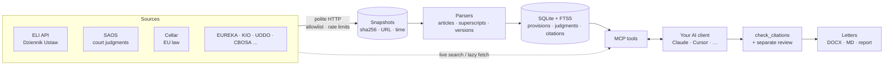

<div align="center">

# ⚖️ prawnik-mcp

**Polish & EU law for AI assistants — with sources you can check.**

An open-source [Model Context Protocol](https://modelcontextprotocol.io) server that lets Claude, Cursor or any MCP client
search Polish and EU statutes and case law, quote **exact provisions with their version and provenance**,
verify citations before an answer is given, and draft simple letters — without inventing law.

[](https://github.com/OWNER/prawnik-mcp/actions/workflows/ci.yml)
[](pyproject.toml)
[](LICENSE)
[](https://modelcontextprotocol.io)
[](docs/quality.md)

[Quick start](#-quick-start) · [Tools](#-tools) · [Sources](#-data-sources) · [How it works](#-how-it-works) ·
[Limitations](#-honest-limitations) · [Polski 🇵🇱](README.pl.md)

</div>

> [!IMPORTANT]
> **This is not legal advice and it is not a lawyer.** It gives your AI assistant verifiable sources, explicit
> statuses and a citation checker. Whether the law *applies to your facts* still needs judgement — ideally a
> lawyer's. No part of this project has been reviewed by a lawyer yet.

## Why

LLMs are fluent in legal language and confidently wrong about the details: repealed wordings, invented case numbers,
a party's argument quoted as the court's view. `prawnik-mcp` makes the assistant work from **primary sources**:

- 📜 **Exact text, exact version.** Every provision comes with the consolidated text it was taken from
  (e.g. *tekst jednolity Dz.U. 2026 poz. 795, stan prawny na 2026-05-19*), a snapshot hash and the source URL.
- 🕰️ **Time-aware.** Ask *as of* an event date: amendments not yet in force, transitional rules and
  unknown wordings are flagged as `temporal_unknown` — never silently assumed.
- 🔎 **Citation checker.** Quotes are verified against the stored text (exact / normalised / wrong article /
  wrong version / not found). Case numbers are checked against court and date.
- 🚦 **Explicit statuses.** `not_found` in the local corpus is *not* "does not exist"; `source_unavailable`,
  `ambiguous`, `stale`, `out_of_scope` are reported as such.
- 🧾 **Letters with a gate.** Three civil/consumer templates export to DOCX/Markdown only when the citation report is
  valid and bound to the exact facts; otherwise you get an explicitly incomplete form.
- 🏠 **Local-first.** Sources are synced into a local SQLite + FTS5 store. No API keys, no GPU, no data leaves your
  machine from the server.

## 🚀 Quick start

```bash
# 1. install (Python 3.12+)
pipx install git+https://github.com/OWNER/prawnik-mcp     # PyPI: `pipx install prawnik-mcp` after the first release

# 2. build a small starter corpus (Civil Code, Consumer Rights Act, Directive 2011/83/EU, a judgment sample)
prawnik-mcp sync

# 3. connect your client — Claude Code:
claude mcp add prawnik -- prawnik-mcp serve
```

<details>
<summary><b>Claude Desktop / Cursor / other MCP clients</b></summary>

Add to the client's MCP configuration (`claude_desktop_config.json`, `.cursor/mcp.json`, …):

```json
{
  "mcpServers": {
    "prawnik": { "command": "prawnik-mcp", "args": ["serve"] }
  }
}
```

Use an absolute path to the executable if your client does not inherit your shell `PATH`
(`which prawnik-mcp`). Data lives in the per-user data directory; override with `--data DIR` or
`PRAWNIK_MCP_DATA`.
</details>

<details>
<summary><b>From source</b></summary>

```bash
git clone https://github.com/OWNER/prawnik-mcp && cd prawnik-mcp
python3.12 -m venv .venv && .venv/bin/pip install -e ".[dev]"
.venv/bin/prawnik-mcp sync --offline     # corpus from recorded samples, no network
.venv/bin/pytest -q                      # ~210 offline tests
```
</details>

Then just ask your assistant, e.g.:

> *Kupiłem kurtkę przez internet 14 września, odebrałem 17. Czy mogę jeszcze odstąpić od umowy? Podaj przepisy z wersją
> i sprawdź cytaty.*

## 🧰 Tools

| Tool | What it does |
|---|---|
| `search_legal` | Find provisions and judgments by identifier (`art. 27 upk`, `I ACa 772/13`, `Dz.U. 2024 poz. 1061`, `RODO`, `dyrektywa 2011/83/UE`) or by description. Local full-text first; **live search** in source APIs when needed (`live`). |
| `get_legal_document` | Exact text of an article / § / ust. / pkt or a judgment, with version, snapshot and URL. Missing documents are **fetched on demand**. |
| `check_citations` | Verify claims and quotes: document exists, quote is faithful and in the cited article and version, case number matches court/date. Produces a `report_id`. |
| `get_citations` | Citation graph: what a judgment cites (statutes, articles, other judgments) and which local judgments cite a given act/article. |
| `list_act_versions` | Timeline of a Polish act: consolidated texts, which are available, amending acts and pending changes. |
| `sources_status` | What the local corpus covers, freshness, terms, known gaps, catalog of all sources. |
| `get_document_template` / `render_document` | Three letters (payment demand, consumer complaint, withdrawal from a distance contract) → DOCX + Markdown + a separate sources report, gated by a valid citation report. |

Prompts: `analysis_procedure` (how the client model should analyse a case) and `applicability_review`
(a separate reviewer pass that checks whether the law actually applies).

## 📚 Data sources

<!-- sources:start -->
| Source | Content | Status | Polite rate | Terms |
|---|---|---|---|---|
| **Cellar — Publications Office of the EU (EUR-Lex)** | EU acts | 🔵 beta | 1 req/s | [terms](https://eur-lex.europa.eu/content/help/data-reuse/reuse-contents-eurlex-details.html) |
| **ELI API — Dziennik Ustaw (Chancellery of the Sejm)** | statutes | 🔵 beta | 1 req/s | [terms](https://api.sejm.gov.pl/eli_pl.html) |
| **SAOS — court judgments (ICM, University of Warsaw)** | judgments | 🔵 beta | 1 req/s | [terms](https://www.saos.org.pl/) |
| **CBOSA — administrative courts (NSA/WSA)** | judgments | ⚪ planned | 0.5 req/s | [terms](https://orzeczenia.nsa.gov.pl/cbo/query) |
| **EUREKA — tax interpretations (Ministry of Finance)** | tax rulings | ⚪ planned | 1 req/s | [terms](https://podatki.gov.pl/narzedzia/eureka) |
| **KIO — National Appeal Chamber (public procurement)** | judgments | ⚪ planned | 1 req/s | [terms](https://orzeczenia.uzp.gov.pl/) |
| **Portal Orzeczeń Sądów Powszechnych (common courts portal)** | judgments | ⚪ planned | 0.5 req/s | [terms](https://orzeczenia.ms.gov.pl/) |
| **UODO — data protection authority decisions** | decisions | ⚪ planned | 1 req/s | [terms](https://orzeczenia.uodo.gov.pl/) |
| **UOKiK — competition and consumer protection decisions** | decisions | ⚪ planned | 0.5 req/s | [terms](https://uokik.gov.pl/) |
<!-- sources:end -->

Everything is fetched from **official public sources**, politely (identifiable User-Agent, per-host rate limits,
`Retry-After`, no CAPTCHA/WAF bypass). **This repository ships no legal corpus** — you sync it yourself, so the
source terms apply to you. Details, endpoints and known gaps: [docs/sources.md](docs/sources.md).

### Growing your corpus

```bash
prawnik-mcp sync --source saos --court-type SUPREME --query "przedawnienie" --limit 500   # Supreme Court judgments
prawnik-mcp sync --source saos --since 2026-01-01 --max-gb 2        # bulk dump of all courts for a date window
prawnik-mcp sync --source eli --act DU/2018/1000 --act DU/1964/16   # specific acts (consolidated text if available)
prawnik-mcp sync --source eli --query "ochronie danych osobowych" --limit 5
prawnik-mcp sync --source cellar --celex 32016R0679                  # GDPR
```

Bulk syncs are checkpointed per page — interrupt with Ctrl-C and run the same command again to resume.
`PRAWNIK_MCP_OFFLINE=1` disables all network access.

## 🧠 How it works



- **Provenance first.** Every stored record points to a raw snapshot (hash, URL, fetch time, parser version).
- **Versions, not just texts.** Polish acts are read from the latest *obwieszczenie* (consolidated text) with its
  state-of-law date, included future amendments and excluded transitional provisions. Acts without a consolidated text
  are stored as *published text* and flagged.
- **Hybrid access.** Local FTS5 search (with Polish inflection heuristics) first; live source search under a time
  budget with a 24 h cache; unknown documents are fetched and snapshotted on demand.
- **The MCP boundary.** A server cannot force a client to follow the procedure or show the report. `prawnik-mcp`
  provides evidence, validators and instructions, and blocks only what it controls — exporting a filled letter.

## 🧪 Quality

~210 offline tests (network is blocked in the test suite), CI on Linux/macOS × Python 3.12/3.13, nightly online checks
against the live sources, a PII scanner and gitleaks on every push. See [docs/quality.md](docs/quality.md) for what is
verified — and what is **not** (no lawyer review, no measured legal accuracy yet).

## ⚠️ Honest limitations

- **Not legal advice.** Citation checks verify *that a quote is real*, not *that the law applies*.
- **Statute history is partial.** Only the latest consolidated text is parsed; older wordings are not reconstructed.
  Many event dates therefore return `temporal_unknown` — by design, instead of guessing.
- **Search is lexical.** FTS5 with simple Polish stemming heuristics; no semantic search yet.
- **Coverage depends on what you sync** and on the sources themselves (SAOS has gaps and occasional data errors,
  which are flagged, not corrected).
- **Letters** cover three narrow civil/consumer situations and do not compute deadlines or interest.
- **Your model provider** receives whatever your client sends. A local MCP server does not make a hosted LLM local.

## 🔒 Privacy

The server stores everything in your local data directory and logs no case facts. Nothing is sent anywhere except
requests to the public legal sources. `prawnik_mcp.privacy` offers pseudonymisation helpers for controlled
pipelines (pseudonymisation ≠ anonymisation). Please do not paste personal data into public issues.

## 🗺️ Roadmap

- Portal Orzeczeń Sądów Powszechnych, UOKiK decisions, CJEU case law, Monitor Polski
- Historical wordings from amending acts; per-article pending changes
- Optional local embeddings for semantic retrieval (only if it beats the lexical baseline on the eval set)
- A curated, lawyer-reviewed evaluation set (80+ cases)

## 🤝 Contributing

Issues and PRs are welcome — especially new sources, parser fixes and evaluation cases.
Read [CONTRIBUTING.md](CONTRIBUTING.md) (no personal data, no invented legal text, polite scraping, compatible licences).

## 🙏 Acknowledgements

Public data from the **Chancellery of the Sejm (ELI API)**, **SAOS (ICM, University of Warsaw)**, the **Publications
Office of the EU (Cellar/EUR-Lex)** and other Polish public authorities. Endpoint knowledge and some connector code
were adapted from open-source projects — see [NOTICE](NOTICE).

## License

Code: [MIT](LICENSE). Legal texts and judgments are not covered by this licence; see
[docs/sources.md](docs/sources.md) for the terms of each source.
